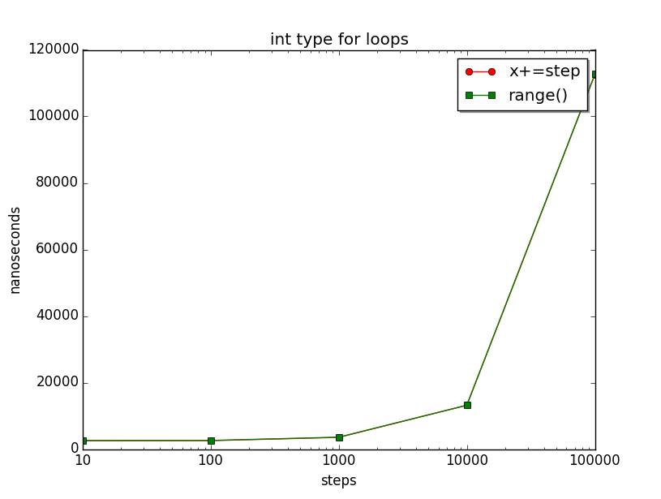
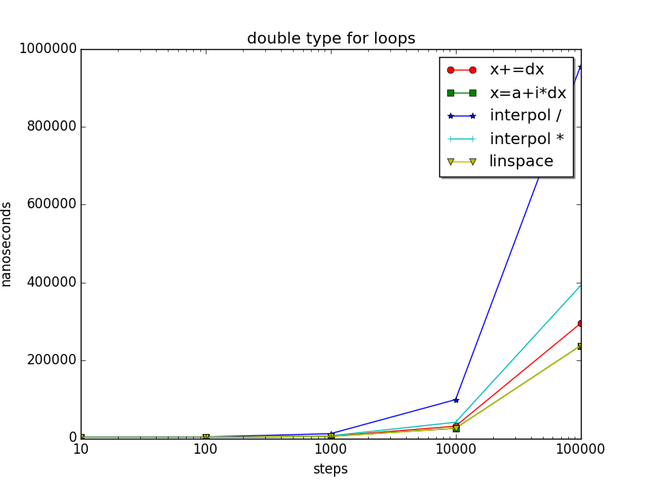

# loop.h - lazy generated range-based for values

This header-only library provides lazy generated values for floating-point, integral and other types in C++14.

# Easy to install and use

* Download [loop.h](loop.h) and `#include` it into your project. 
* Write range-based for loop (see below).
* Compile as C++14 or higher (g++ or clang with option `-std=c++14`).

```cpp
#include "loop.h"
// ...
using namespace loop;

for (auto x : linspace(0, 1.0, 4))     ... // 0 0.25 0.5 0.75 1

for (auto i : countdown(5))            ... // 4 3 2 1 0
for (auto i : range(5))                ... // 0 1 2 3 4
for (auto i : range(0, 5))             ... // 0 1 2 3 4
for (auto i : range(0, 6, 2))          ... // 0 2 4
for (auto i : range(0, 6, 2, true))    ... // 0 2 4 6
for (auto i : range(5, 0, -1))         ... // 5 4 3 2 1

using namespace std::string_literals;
for (auto x : generate("I"s, 5, "E"))  ... // : I IE IEE IEEE IEEEE
```
See also: [loop.demo.cpp](loop.demo.cpp)

# A more detailed documentation
## Equispaced floating-point values 

`linspace(a, b, n [, boundary])` creates equispaced values $x_i \in [a,b], i = 0,...,n$ with $x_i = a + i(b-a)/n$:  
```cpp
using namespace loop;

for (auto x : linspace(0, 1.0, 4)) ... // 0 0.25 0.5 0.75 1
for (auto x : linspace(1.0, 0, 4)) ... // 1 0.75 0.5 0.25 0

for (auto x : linspace(0, 1.0, 4, boundary::closed))    ... // 0 0.25 0.5 0.75 1
for (auto x : linspace(0, 1.0, 4, boundary::rightopen)) ... // 0 0.25 0.5 0.75
for (auto x : linspace(0, 1.0, 4, boundary::leftopen))  ... // 0.25 0.5 0.75 1
for (auto x : linspace(0, 1.0, 4, boundary::open))      ... // 0.25 0.5 0.75
```
See also: MATLAB, Numpy library in Python

## Generic loop generator

`generate(startvalue, count, increment)` creates `count` values by successively doing `startvalue += increment`:
```cpp
using namespace loop;

for (auto x : generate(4, 5, -1))                 ... // 4 3 2 1 0
for (auto x : generate(std::string("O"), 5, "i")) ... // O Oi Oii Oiii Oiiii
```
See also: Semenov

## Integral value ranges
`range([start,] stop [, step [, withend]])` creates values beginning with `start` towards `stop` with given `step` size: 
```cpp
using namespace loop;

for (auto i : range(5))             ... // 0 1 2 3 4
for (auto i : range(0, 5))          ... // 0 1 2 3 4
for (auto i : range(5, 0, -1))      ... // 5 4 3 2 1
for (auto i : range(0, 6, 2, true)) ... // 0 2 4 6
for (auto i : countdown(5))         ... // 4 3 2 1 0
```
`countdown(n)` is equivalent to `range(n-1, 0, -1, true)`.
Integral ranges can create indices for standard containers like
`std::vector<T> v`:
```cpp
for (auto i : range(v.size())     ... // 0 ... v.size()-1 
for (auto i : range(3, v.size())  ... // 3 ... v.size()-1 
for (auto i : countdown(v.size()) ... // v.size()-1 ... 0
```
Mixed signed/unsigned parameters are allowed.

See also: Boost irange, cppitertools


## Benchmarks




## Links & other libraries

Related work:

* [Numpy linspace()](http://docs.scipy.org/doc/numpy/reference/generated/numpy.linspace.html),  [Matlab linspace()](http://de.mathworks.com/help/matlab/ref/linspace.html)
* [Boost irange()](http://www.boost.org/doc/libs/1_57_0/libs/range/doc/html/range/reference/ranges/irange.html)
* [cppitertools](https://github.com/ryanhaining/cppitertools) 
* [Mikhail Semenov](http://www.codeproject.com/Articles/876156/Convenient-Constructs-For-Stepping-Through-a-Range) : Convenient Constructs For Stepping Through a Range.

Toolstack:

* TDM GCC 4.9.2 / Debian Clang 3.4, CMake
* Phil Nash: [Catch](https://github.com/philsquared/Catch) Unit Tests
* Nick Athanasiou: [Benchmarking in C++](https://ngathanasiou.wordpress.com/2015/04/01/benchmarking-in-c/)
* [Win Python](http://winpython.sourceforge.net/) for benchmark diagrams.

# TODO, known bugs, limitations

* C++11 not supported
* Test other compilers
* linspace() for complex type, linear algebra types (3D vectors etc.)?
* range(0, max_size_t, 1, true) is empty
